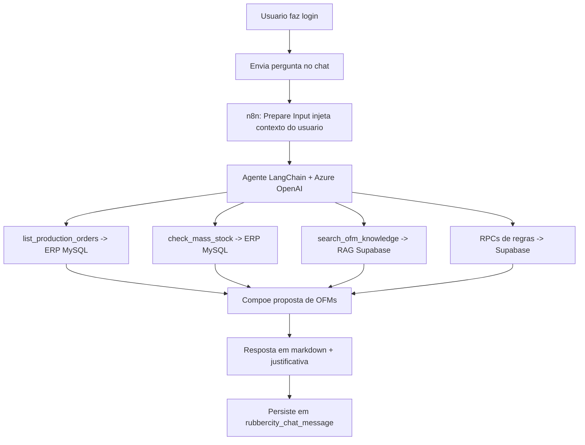
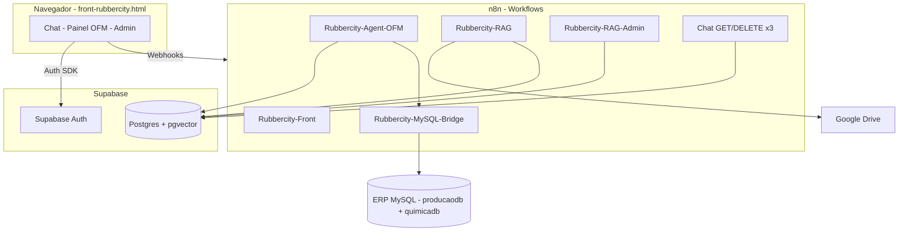
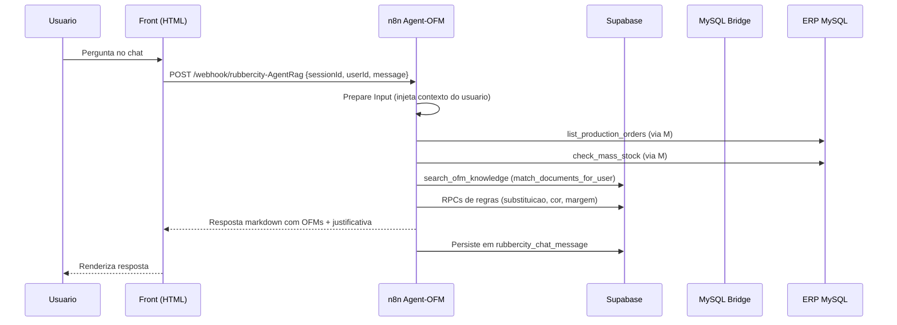
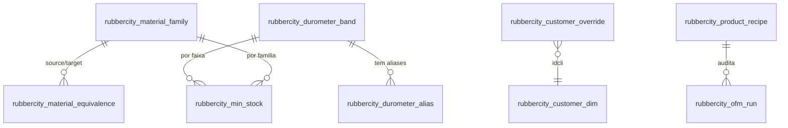

# Documentação do Projeto Rubbercity — Agente OFM + RAG

## Sumário Executivo

O **Rubbercity** é um agente de inteligência artificial corporativo que apoia a decisão das **Ordens de Fabricação de Massa (OFM)** na indústria de borracha Rubbercity. O sistema lê, em tempo real, o ERP de produção (MySQL) e cruza esses dados com as **regras de negócio do setor de massa** — equivalências entre famílias de massa, regras de mistura por cor, exceções por cliente, margens de segurança e o fluxo de status de produção — para **propor quais massas fabricar, em que formulação, em qual quantidade e com qual justificativa**.

O principal usuário é o responsável pelo setor de massa (Alex Szabo), que hoje toma essas decisões manualmente. O sistema combina três capacidades: **RAG** (busca semântica sobre o PDF descritivo OFM e demais procedimentos liberados por equipe), **ferramentas de banco** que consultam o ERP MySQL em modo somente-leitura, e **regras de negócio estruturadas** em tabelas Supabase editáveis sem código. Tudo é acessado por uma interface web única (chat + painel + administração).

**Stack em uma frase:** front-end HTML/JS single-file → orquestração n8n (webhooks) → agente LangChain com Azure OpenAI → Supabase (Postgres + pgvector + Auth) para regras/RAG/auth e ERP MySQL para dados de produção.

> [!NOTE]
> Este documento foi gerado por engenharia reversa do código-fonte do repositório (migrations SQL, workflows n8n e front-end). Afirmações inferidas e não comprovadas diretamente no código estão marcadas com **(inferido)**. Valores de credenciais reais não são reproduzidos — apenas o nome e o propósito de cada variável.

---

## Visão de Negócio

### Propósito e problema resolvido

A Rubbercity fabrica peças de borracha (rolos, camisas, revestimentos) que exigem a preparação prévia de **massa** com a formulação correta: família de material, faixa de dureza, cor e quantidade. Decidir quais massas produzir a cada dia envolve conhecimento especializado:

- Quais pedidos de produção já estão prontos para virar massa (e quais ainda têm pendências de queima, usinagem ou balanceamento).
- Qual a formulação oficial para cada material/dureza pedido.
- Se há saldo de massa em estoque que pode ser reaproveitado.
- Se uma massa pode **substituir** outra (ex.: AG cobre ABI/EPP/RC até a dureza 35/40).
- Se cores podem ser **misturadas** (branca nunca mistura com vermelha; preta só entra em mix de preta).
- Quanto de **margem de segurança** aplicar sobre o peso teórico.
- **Exceções por cliente** (AMBEV, AVANÇO, PRINTGRAF, BRASMETAL têm regras próprias).

Esse conhecimento estava concentrado em uma pessoa e num PDF descritivo. O Rubbercity **codifica essas regras**, lê o ERP automaticamente e entrega uma proposta de OFMs justificada item a item, reduzindo dependência de especialista único e acelerando a decisão.

### Atores e papéis

| Ator | Papel | Origem no código |
|------|-------|------------------|
| Administrador | Gerencia usuários, equipes, categorias e documentos; edita regras OFM | `role = 'admin'` em `auth.users.raw_user_meta_data`; guard `rubbercity_is_admin()` |
| Membro / Visualizador | Usa o chat e o painel OFM; vê apenas documentos das suas equipes | `role = 'visualizador'`; guard `rubbercity_is_member()` |
| Alex Szabo (responsável da massa) | Usuário-alvo do agente OFM; pertence à equipe "Massa" | README; equipe com acesso à categoria `OFM` |
| Agente OFM (sistema) | Lê ERP + regras e propõe OFMs | workflow `Rubbercity-Agent-OFM` |
| ERP Rubbercity | Origem dos pedidos e do estoque de massa | MySQL `producaodb` + `quimicadb`, usuário `senai-ia` (read-only) |

Todo controle de acesso é ancorado em `company_name = 'rubbercity'`, garantindo isolamento do ambiente multi-cliente.

### Jornadas principais

**Jornada 1 — Perguntar ao agente "Monte as OFMs do dia":**

1. O usuário faz login (Supabase Auth) e abre o chat.
2. Envia a mensagem; o front injeta o contexto do usuário (`nome` + `ID`).
3. O agente consulta o ERP (pedidos + estoque), aplica as regras OFM e responde em markdown com a lista de massas propostas e a justificativa de cada decisão.
4. A conversa é persistida com histórico por sessão.

**Jornada 2 — Painel OFM:** a interface possui uma visão "Painel" (além do "Chat") que consome o motor de decisões resumido do ERP, exibindo grupos de pedidos com badge de prioridade/SLA e proposta de OFM.

**Jornada 3 — Administração de conhecimento (RAG):** o administrador adiciona/atualiza documentos (PDF descritivo OFM, instruções técnicas), que são extraídos, "chunkados", vetorizados e indexados para a busca semântica, respeitando a ACL por equipe.



### Regras de negócio capturadas

| Regra de negócio | Onde está no código |
|------------------|---------------------|
| Faixas oficiais de dureza 20/25, 25/28, 30/33, 35/40 | `rubbercity_durometer_band` (008) |
| Durezas vizinhas que caem em cada faixa (ex.: 23/27 → 20/25) | `rubbercity_durometer_alias` (008) |
| Famílias de massa (AG, ABI, EPP, RC, FLEX, PU, NEOPRENE, HYPALON, EBONITE, NAT, SILICONE...) | `rubbercity_material_family` (008/012) |
| AG substitui ABI/EPP/RC até 35/40; complementos FLEX/PU | `rubbercity_material_equivalence` + `rubbercity_ofm_can_substitute` |
| Mix de cor (branca×vermelha proibida; preta só em preta; verde/cinza em preta) | `rubbercity_color_mix_rule` + `rubbercity_ofm_can_mix_colors` |
| Estoque mínimo (AG 20/25, 25/28, 30/33 = 90 kg; AG 35/40 = 30 kg) | `rubbercity_min_stock` (008/011) |
| Receitas especiais (ROLL_BOW, HYPALON, EBONITE_BASE, DUPLA_CAMADA, FLAMENGUISTA) | `rubbercity_product_recipe` + `rubbercity_ofm_recipe` |
| Margem de segurança por família/dureza/parede | `rubbercity_safety_margin` + `rubbercity_ofm_safety_margin` (010/014) |
| Quais status do ERP aceitar/ignorar/aguardar | `rubbercity_status_workflow` + `rubbercity_ofm_status_decision` |
| Exceções por cliente (AMBEV, AVANÇO, PRINTGRAF, BRASMETAL) | `rubbercity_customer_override` + `rubbercity_ofm_resolve_customer` |
| Classificação de prioridade/SLA (URGENTE, ATRASADO, RETORNO_BAL, SLA_3D...) | `rubbercity_ofm_priority_band` (012) |
| Aliases de cor ERP↔código canônico (PRETA↔PT) | `rubbercity_color_alias` + `rubbercity_color_canonical` (014) |

> [!TIP]
> Todas essas tabelas são **lidas por qualquer membro** e **editáveis apenas por administrador** (via SQL ou, no futuro, painel). Isso permite calibrar regras de negócio **sem alterar código**.

### Lógica de decisão da OFM (raciocínio padrão do agente)

1. `list_production_orders` — busca pedidos aceitáveis (status + flags).
2. Para cada pedido: resolve override do cliente → formulação oficial → saldo de estoque.
3. Se faltar massa: avalia substituição de família e regras de mix de cor.
4. Aplica margem de segurança sobre o peso teórico (kt).
5. Decompõe receitas especiais quando aplicável.
6. Agrupa por (formulação, cor) e propõe lotes, listando as OFMs com justificativa.

Pedidos com pendência (queima = `S`, usinagem incompleta, balanceamento pendente, ENDs, retífica pura) **não geram OFM** — são listados à parte com o motivo.

### Entidades de domínio (glossário)

- **OFM (Ordem de Fabricação de Massa):** decisão de produzir um lote de massa numa formulação, cor e quantidade.
- **Família de massa:** classe do material (AG, ABI, RC, PU, NEOPRENE...).
- **Faixa de dureza (durometer band):** intervalo nominal de dureza (Shore A), ex.: 30/33.
- **Formulação:** receita oficial do ERP que traduz material + dureza num código de fórmula (`quimicadb.formula`).
- **kt:** peso teórico do pedido (base do cálculo).
- **Margem de segurança:** percentual adicionado ao kt para cobrir perdas de processo.
- **Override de cliente:** exceção que altera a massa/cor padrão para um cliente específico.
- **Mix de cor:** combinação permitida (ou não) entre cor da massa em estoque e cor pretendida no rolo.

---

## Visão Técnica

### Stack e dependências

| Camada | Tecnologia | Origem |
|--------|-----------|--------|
| Front-end | HTML/CSS/JS single-file · Supabase JS SDK · Lucide icons | `front-rubbercity.html` |
| Orquestração | n8n (self-hosted, `longflatworm-n8n.cloudfy.live`) | `workspaces/*.json` |
| LLM + embeddings | Azure OpenAI — `text-embedding-3-small`, `gpt-4o`/`gpt-5.x` | workflows Agent/RAG |
| Banco de regras/RAG/auth | Supabase (Postgres 15 + pgvector) | `migrations-clean/*.sql` |
| ERP (origem dos dados) | MySQL 5.x `45.185.0.14:3306` (`producaodb`, `quimicadb`), user `senai-ia` read-only | `Rubbercity-MySQL-Bridge.json` |
| Armazenamento de documentos | Google Drive (uma pasta por categoria) | workflow RAG |
| Autenticação | Supabase Auth (e-mail/senha) | migration 001 |

### Arquitetura geral



### Estrutura de pastas

```text
rubbercity-agent/
  README.md                       visao geral do projeto
  front-rubbercity.html           SPA single-file (chat + painel + admin)
  migrations-clean/               14 migrations Supabase (001->014)
  workspaces/                     9 workflows n8n
RAG/
  BD-RUBBERCITY.pdf               base de dados/regras do ERP (fonte de negocio)
  DESCRITIVO OFM - Ordem Fabricacao de Massas.pdf   PDF descritivo das regras OFM
```

É um repositório de **artefatos de integração** (não há build de aplicação compilada): o "código" é composto por SQL (Supabase), JSON de workflows (n8n) e um HTML single-file. **(inferido)** Não há `package.json`, `pyproject.toml` ou similar na raiz — o projeto é orientado a configuração/declarativo.

### Fluxo de uma requisição ponta a ponta



### API / rotas / handlers (webhooks n8n)

| Webhook | Método | Workflow | Função |
|---------|--------|----------|--------|
| `/rubbercity-chat` | GET | Rubbercity-Front | Serve o HTML do front |
| `/rubbercity-AgentRag` | POST | Rubbercity-Agent-OFM | Agente OFM (tools MySQL + Supabase) |
| `/rubbercity-mysql-orders` | POST | MySQL-Bridge | Pedidos de produção aceitáveis |
| `/rubbercity-mysql-orders-summary` | POST | MySQL-Bridge | Pedidos agrupados + SLA/prioridade |
| `/rubbercity-mysql-orders-detail` | POST | MySQL-Bridge | Detalhe de um grupo de pedidos |
| `/rubbercity-mysql-stock` | POST | MySQL-Bridge | Saldos de massa (`quimicadb.matprima`) |
| `/rubbercity-mysql-formula` | POST | MySQL-Bridge | Tradução material+dureza → formulação |
| `/rubbercity-index-drive` | POST | RAG | Upload via chat (efêmero, 24 h) |
| `/rubbercity-rag-upload` | POST | RAG | Upload permanente (admin/ERP) |
| `/rubbercity-rag-reindex` | POST | RAG | Reprocessa 1/N/todos documentos |
| `/rubbercity-rag-upsert` | POST | RAG-Admin | Upsert atômico por `file_id` |
| `/rubbercity-rag-docs` | GET | RAG-Admin | Lista documentos indexados |
| `/rubbercity-rag-doc-delete` | DELETE | RAG-Admin | Remove um documento |
| `/rubbercity-rag-purge-all` | POST | RAG-Admin | Limpa toda a base vetorial |
| `/rubbercity-sessions` | GET | Chat-GET-Sessions | Sessões do usuário (`?userId=`) |
| `/rubbercity-history` | GET | Chat-GET-History | Histórico (`?sessionId=&userId=`) |
| `/rubbercity-session` | DELETE | Chat-DELETE-Session | Apaga sessão (`?sessionId=&userId=`) |

Base do front: `const API_BASE = "https://longflatworm-n8n.cloudfy.live/webhook"`.

### Modelo de dados (Supabase / Postgres + pgvector)

Principais tabelas e funções, agrupadas por domínio:

**Auth / ACL / RAG / Chat (migrations 001–007):**

| Objeto | Tipo | Função |
|--------|------|--------|
| `rubbercity_is_admin()` / `rubbercity_is_member()` | função | Guards de papel, ancorados em `company_name='rubbercity'` |
| `rubbercity_admin_list_users/update_user/...` | RPC | CRUD de usuários admin-only |
| `rubbercity_document_categories` | tabela | Categorias com `drive_folder_id` |
| `rubbercity_teams` + ACL team×categoria | tabela | Equipes e permissões |
| `rubbercity_documents` | tabela | Chunks + embeddings (pgvector 1536d) |
| `rubbercity_document_metadata` | tabela | Metadados por documento |
| `rubbercity_match_documents_for_user(userId, embedding, ...)` | RPC | Busca vetorial com ACL |
| `rubbercity_chat_message` | tabela | Histórico de chat (com `user_id` via trigger) |

**Domínio OFM (migrations 008–014):**

| Objeto | Tipo | Função |
|--------|------|--------|
| `rubbercity_durometer_band` / `_alias` | tabela | Faixas oficiais e durezas vizinhas |
| `rubbercity_material_family` | tabela | Famílias de massa |
| `rubbercity_material_equivalence` | tabela | Substituições permitidas |
| `rubbercity_color_mix_rule` | tabela | Regras de mix por cor |
| `rubbercity_min_stock` | tabela | Estoque mínimo desejado |
| `rubbercity_product_recipe` | tabela | Receitas especiais (JSONB de componentes) |
| `rubbercity_status_workflow` | tabela | Status ACCEPT/IGNORE/WAIT |
| `rubbercity_customer_override` (+`customer_idcli`) | tabela | Exceções por cliente |
| `rubbercity_customer_dim` | tabela | Dimensão idcli → nome de cliente |
| `rubbercity_color_alias` | tabela | Aliases de cor ERP↔código canônico |
| `rubbercity_safety_margin` | tabela | Margem editável por família/dureza |
| `rubbercity_ofm_run` | tabela | Auditoria de OFMs propostas/emitidas |
| `rubbercity_ofm_*` (durometer_band, safety_margin, can_substitute, can_mix_colors, resolve_customer, status_decision, recipe, priority_band) | RPC | Funções de decisão consumidas pelo agente/painel |



**ERP MySQL (origem dos dados, somente leitura):**

- `producaodb.producao` — pedidos de produção. Colunas usadas: `ped_mestre, pedido, status, puliq, mat, kt, d, da, cor, queima, bl, bl_desba, blpr, blfim, usinagem, usinafinal, usi_ter, usi_stat, urgente, prazo, dt_entrega, dt_entra`.
- `quimicadb.matprima` — saldos de matéria-prima/massa (`id_f, formulacao, mat, dt, saldo`).
- `quimicadb.formula` — fórmulas oficiais (`id_f, formulacao, mat, d1, d2`, filtro `nf='X'`).

> [!WARNING]
> A coluna de usinagem terceirizada chama-se `usi_ter` (com underscore), confirmado via `SHOW COLUMNS`, e **não** `usiter` como aparecia na documentação interna do ERP. Esse tipo de divergência schema-real vs. documentação foi corrigido no código do bridge.

### Integrações externas

- **Azure OpenAI** — geração de respostas do agente e embeddings dos documentos.
- **Supabase** — Postgres (regras + RAG), pgvector (busca semântica) e Auth.
- **ERP MySQL** — leitura de pedidos e estoque (usuário read-only).
- **Google Drive** — armazenamento dos documentos por categoria.
- **n8n / Cloudfy** — hospedagem dos workflows e exposição dos webhooks.

### Configuração e variáveis (credenciais n8n — sem valores)

| Credencial / placeholder | Propósito |
|--------------------------|-----------|
| `Rubbercity-DB` (`REPLACE_ME_RUBBERCITY_DB`) | Conexão Postgres com o Supabase da Rubbercity |
| `REPLACE_ME_AZURE_OPENAI_CRED` | Credencial Azure OpenAI (Agent OFM + RAG) |
| `REPLACE_ME_SUPABASE_CRED` | API Supabase (vector store do Agent OFM) |
| `Rubbercity ERP` (`REPLACE_ME_MYSQL_RBCT`) | MySQL ERP read-only (`senai-ia@45.185.0.14:3306`) |

> [!DANGER]
> O repositório contém, no README e nas notas dos workflows, **credenciais reais do ERP MySQL** (host, usuário e senha) em texto claro. Recomenda-se **rotacionar imediatamente** essa senha, removê-la do versionamento e movê-la para o cofre de credenciais do n8n. Nunca versionar segredos.

### Segurança

- **Autenticação:** Supabase Auth (e-mail/senha); identidade carimbada com `company_name='rubbercity'`.
- **Autorização:** RLS em todas as tabelas; `SELECT` para membros, escrita para admin; RPCs admin-only com `RAISE EXCEPTION` para acesso negado; SECURITY DEFINER controlado com `search_path` fixo.
- **ACL de documentos:** `rubbercity_match_documents_for_user` filtra por categorias permitidas da equipe; admin enxerga tudo.
- **Privacidade de chat:** todos os endpoints de chat exigem `userId` e filtram por ele no SQL — descobrir um `sessionId` alheio retorna 0 linhas.
- **ERP read-only:** o usuário `senai-ia` só lê; nenhuma escrita no ERP.
- **Anti self-delete:** admin não pode excluir a si mesmo.

> [!WARNING]
> As queries do MySQL Bridge montam SQL por **interpolação de strings** de parâmetros do corpo da requisição (com `replace(/'/g,'')` como sanitização). Apesar do escape de aspas e do usuário read-only, recomenda-se **parametrização real** (prepared statements) para eliminar risco de injeção. **(inferido)** — avaliar conforme política de segurança.

---

## Operação

### Setup do zero

1. Subir o Supabase e rodar as migrations em ordem **001 → 014** (SQL Editor, uma a uma).
2. Importar os 9 workflows de `workspaces/` no n8n.
3. Substituir os placeholders de credencial (`REPLACE_ME_*`) pelos IDs reais.
4. Ativar todos os workflows; verificar que o `Rubbercity-MySQL-Bridge` responde nas rotas `orders`/`stock`/`formula`.
5. Servir o `front-rubbercity.html` via workflow `Rubbercity-Front` (ou hospedagem estática).
6. Login com `admin@rubbercity.com.br` / `@Admin123` e **trocar a senha imediatamente**.
7. Configurar o `drive_folder_id` da categoria `OFM` e fazer upload do PDF descritivo OFM.
8. Criar a equipe "Massa", dar acesso à categoria `OFM` e associar Alex Szabo.

### Rollback

Cada migration tem o bloco `-- DOWN` comentado no final. Para reverter, descomentar e executar na ordem inversa (014 → 001).

---

## Lacunas e Recomendações

**Lacunas identificadas na extração:**

- O conteúdo dos PDFs em `RAG/` (descritivo OFM e BD-Rubbercity) é a fonte original das regras, mas não foi lido binariamente nesta documentação — as regras foram extraídas da forma como o código as codificou. **(inferido)** Pode haver regras no PDF ainda não modeladas em tabela.
- O system prompt completo do agente (texto integral) e o detalhe de cada tool LangChain não foram transcritos linha a linha; descritos pelo comportamento documentado.
- Não há suíte de testes automatizados no repositório — a validação é manual/operacional.

**Recomendações:**

1. **Segurança:** rotacionar a senha do ERP exposta; migrar para prepared statements no MySQL Bridge.
2. **Auditoria:** popular `rubbercity_ofm_run` em toda execução do agente (chat e cron) para rastrear decisões.
3. **Automação:** workflow agendado diário (cron) que gera a proposta de OFMs em modo batch e envia por e-mail.
4. **Administração de regras:** página admin no front para CRUD direto das tabelas OFM (hoje editáveis só por SQL).
5. **Calibração:** ajustar margens de segurança com dados reais de perda de processo.
6. **Testes:** adicionar testes de regressão das RPCs de decisão (substituição, cor, margem, status).

---

## Anexos

### Arquivos-chave

- `rubbercity-agent/README.md` — visão geral e setup.
- `rubbercity-agent/front-rubbercity.html` — SPA (chat + painel + admin).
- `rubbercity-agent/migrations-clean/008_ofm_reference_tables.sql` — tabelas mestre OFM.
- `rubbercity-agent/migrations-clean/010_ofm_rules_rpc.sql` — RPCs de decisão.
- `rubbercity-agent/migrations-clean/012_ofm_priority_dim_and_run.sql` — prioridade/SLA e auditoria.
- `rubbercity-agent/migrations-clean/014_color_alias_and_safety_margin.sql` — aliases de cor e margem editável.
- `rubbercity-agent/workspaces/Rubbercity-MySQL-Bridge.json` — pontes para o ERP MySQL.
- `rubbercity-agent/workspaces/Rubbercity-Agent-OFM.json` — agente OFM.

### Glossário de siglas

- **OFM** — Ordem de Fabricação de Massa.
- **RAG** — Retrieval-Augmented Generation (geração aumentada por recuperação).
- **ACL** — Access Control List (lista de controle de acesso).
- **RLS** — Row Level Security (segurança em nível de linha do Postgres).
- **SLA** — Service Level Agreement (prazo acordado de entrega).
- **ERP** — Enterprise Resource Planning (sistema de gestão da produção).
